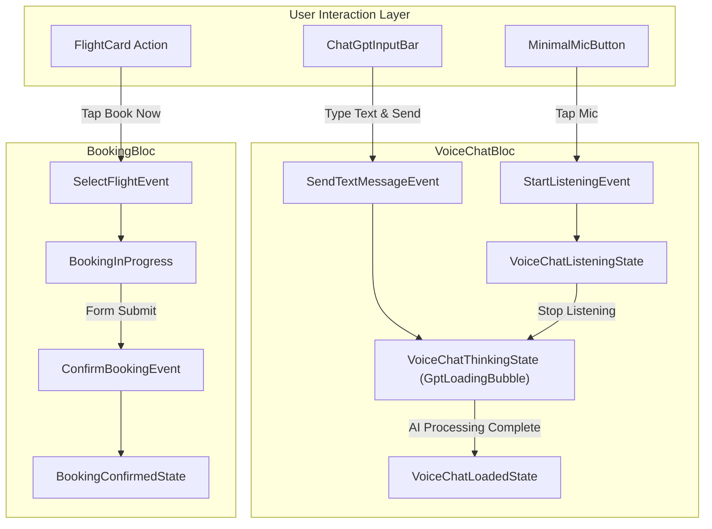
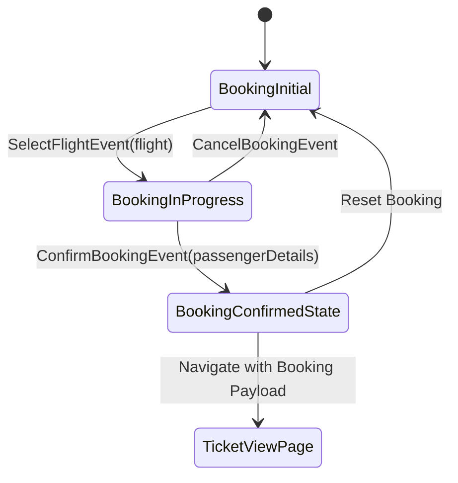

# BLoC State Management & Audio Data Flow Deep-Dive

This document provides a line-by-line and step-by-step breakdown of state management in the application using **`flutter_bloc`**, covering event dispatching, state propagation, microphone speech stream handling, ChatGPT-style thinking bubble loading states, and PNR booking lifecycle transitions.

---

## Architecture Overview: State Management

The application features two primary BLoCs:

1. **`VoiceChatBloc`**: Manages conversational state, voice capture (`speech_to_text`), text input, AI intent processing via `AiService`, Text-to-Speech vocal playback (`flutter_tts`), and search criteria state.
2. **`BookingBloc`**: Manages flight selection, passenger data collection modal, PNR generation, and digital ticket state.



---

## VoiceChatBloc Deep-Dive (`lib/features/flight_booking/presentation/bloc/`)

### 1. Event Definitions (`voice_chat_event.dart`)

| Event Class | Parameters | Trigger Condition |
|:---|:---|:---|
| `InitVoiceChatEvent` | None | Dispatched on page init; initializes STT hardware and speaks welcome greeting. |
| `StartListeningEvent` | None | User taps floating microphone button. |
| `StopListeningEvent` | None | Audio silence detected or user manually taps mic button to finish recording. |
| `SendTextMessageEvent` | `String text` | User submits text via `ChatGptInputBar`. |
| `SetGeminiApiKeyEvent` | `String apiKey` | User saves a new Gemini API key in key dialog. |
| `ClearCriteriaEvent` | None | User clicks "Clear All Filters" in active criteria bar. |

---

### 2. State Lifecycle & Properties (`voice_chat_state.dart`)

`VoiceChatState` is an immutable class extending `Equatable` to ensure UI components rebuild only when relevant properties mutate.

```dart
class VoiceChatState extends Equatable {
  final List<ChatMessage> messages;
  final bool isListening;
  final bool isThinking; // Triggers GptLoadingBubble
  final String partialSpeechText;
  final SearchCriteria searchCriteria;
  final List<Flight> matchingFlights;
  final List<String> smartBadges;
  final String? activeApiKey;
  final String? errorMessage;
  final double soundLevel; // For audio wave animation
}
```

---

### 3. Step-by-Step Code Flow: Voice Input to AI Execution

```text
[User Taps Mic]
      │
      ▼
1. VoiceChatBloc.on<StartListeningEvent>()
      │ ──► Sets state: isListening = true, partialSpeechText = ''
      │
2. SttService.listen(onResult: (text, isFinal) { ... })
      │ ──► Stream updates: partialSpeechText = "fly from mumbai to dubai"
      │
[User Stops Speaking / Silence Timeout]
      │
      ▼
3. VoiceChatBloc.on<StopListeningEvent>()
      │ ──► Sets state: isListening = false, isThinking = true (GptLoadingBubble rendered)
      │
4. ParseUserIntentUseCase(userPrompt, currentCriteria)
      │ ──► HybridAiServiceImpl / LocalRuleAiServiceImpl execution
      │
5. Success(AiResult payload)
      │ ──► Updates SearchCriteria & matching flights dataset
      │ ──► Calls TtsService.speak(conversationalResponse)
      │
6. Emits VoiceChatState
      │ ──► Sets isThinking = false
      │ ──► Appends Assistant ChatMessage to timeline
      │ ──► Sliding FlightListSheet pops up with matching FlightCard items
```

---

## BookingBloc Deep-Dive (`lib/features/flight_booking/presentation/bloc/`)

### 1. State Machine & Event Handling



### 2. Detailed Event-to-State Mapping Table

| Event | Input Data | Mutated State | Output Action |
|:---|:---|:---|:---|
| `SelectFlightEvent` | `Flight selectedFlight` | `BookingInProgress(selectedFlight)` | Launches `BookingDialog` modal with flight details. |
| `ConfirmBookingEvent` | `PassengerDetails passenger` | `BookingConfirmedState(booking)` | Executes `ConfirmBookingUseCase`, generates unique 6-character PNR (e.g., `PNR-8F3K91`), saves to local storage. |
| `CancelBookingEvent` | None | `BookingInitial` | Closes booking sheet and resets selection. |

---

## ChatGPT-Style Thinking Bubble Integration (`GptLoadingBubble`)

When `VoiceChatState.isThinking == true`, the presentation layer renders `GptLoadingBubble` directly in the chat stream:

```dart
if (state.isThinking)
  const Padding(
    padding: EdgeInsets.symmetric(vertical: 8.0),
    child: GptLoadingBubble(),
  ),
```

`GptLoadingBubble` animates three pulsing dots and displays cycling status text (*"Thinking..."*, *"Searching 200+ flights..."*, *"Applying layover & date filters..."*) to give users transparent feedback while Gemini LLM or Local NLP evaluates search constraints.
