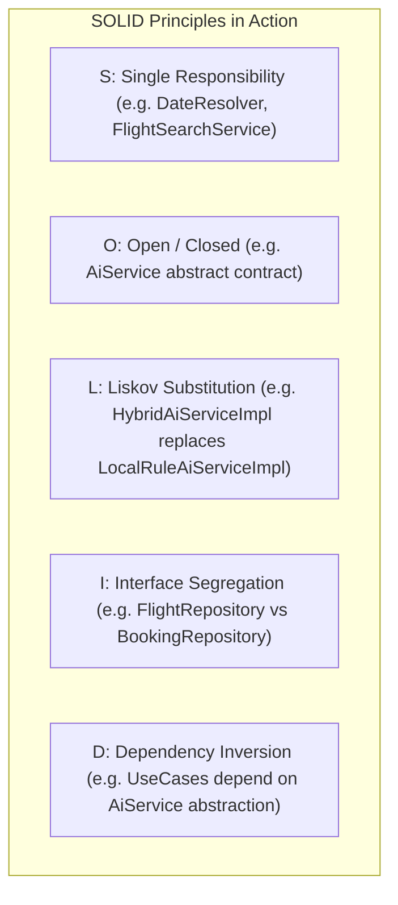

# LLD Architecture, SOLID Principles & Developer Guide

This document provides a Low-Level Design (LLD) specification explaining how **SOLID Principles** and **Design Patterns** are applied across the codebase, followed by a **Developer Extension Matrix** that maps exact change requests to specific files, functions, and lines of code.

---

## SOLID Principles in Codebase

The architecture adheres strictly to object-oriented Low-Level Design (LLD) standards:



---

### 1. Single Responsibility Principle (SRP)
> *"A class should have one, and only one, reason to change."*

Each component in the system is dedicated to a single operational task:
- **`DateResolver`** (`lib/core/utils/date_resolver.dart`): Dedicated exclusively to evaluating temporal expressions (*"next month 7"*, *"tomorrow"*) and converting them to `TravelDatePreference`. It contains zero UI logic or network code.
- **`FlightSearchService`** (`lib/features/flight_booking/domain/services/flight_search_service.dart`): Responsible solely for filtering and sorting flight lists based on criteria and generating smart badges.
- **`SttService`** (`lib/core/services/stt_service.dart`): Wraps hardware microphone speech recognition.
- **`TtsService`** (`lib/core/services/tts_service.dart`): Handles audio speech synthesis playback.

---

### 2. Open / Closed Principle (OCP)
> *"Software entities should be open for extension, but closed for modification."*

The AI processing layer is built around an abstract contract:

```dart
// Contract defined in lib/core/services/ai_service.dart
abstract class AiService {
  String? apiKey;
  void setApiKey(String? key);

  Future<Result<AiResult>> parseUserPrompt({
    required String userPrompt,
    required SearchCriteria currentCriteria,
    required List<Flight> availableFlights,
    String? lastExpectedParameter,
  });
}
```

- **Extension**: New AI providers (e.g. OpenAI GPT-4o, Claude 3.5, or Local Ollama) can be introduced by creating a new class implementing `AiService` (e.g. `OpenAiServiceImpl`).
- **Closed for Modification**: `ParseUserIntentUseCase` and `VoiceChatBloc` consume `AiService` without modifying a single line of existing execution logic.

---

### 3. Liskov Substitution Principle (LSP)
> *"Subtypes must be substitutable for their base types."*

Both `HybridAiServiceImpl` (online Gemini LLM) and `LocalRuleAiServiceImpl` (offline rule engine) implement `AiService`. 

```dart
// High-level use case accepts any AiService instance seamlessly
class ParseUserIntentUseCase {
  final AiService aiService;
  ParseUserIntentUseCase(this.aiService);

  Future<Result<AiResult>> call(...) {
    return aiService.parseUserPrompt(...);
  }
}
```

If `HybridAiServiceImpl` loses network connection or encounters an API key error, it delegates execution to `LocalRuleAiServiceImpl` internally. The caller (`ParseUserIntentUseCase`) receives a valid `Success(AiResult)` payload regardless of which implementation served the request.

---

### 4. Interface Segregation Principle (ISP)
> *"Clients should not be forced to depend on methods they do not use."*

Repository interfaces are split by domain area rather than combined into a monolithic repository:
- **`FlightRepository`** (`domain/repositories/flight_repository.dart`): Exposes search and lookup contracts.
- **`BookingRepository`** (`domain/repositories/booking_repository.dart`): Exposes passenger booking and ticket cancellation contracts.

UI BLoCs depend only on the specific repository interface required for their operations.

---

### 5. Dependency Inversion Principle (DIP)
> *"High-level modules should not depend on low-level modules. Both should depend on abstractions."*

High-level domain use cases (`ParseUserIntentUseCase`, `SearchFlightsUseCase`) do not import concrete data sources or hardware APIs. They rely on abstract interfaces (`AiService`, `FlightRepository`).

Dependencies are injected globally using **GetIt** (`lib/core/services/service_locator.dart`):

```dart
// Dependency Injection setup in service_locator.dart
final sl = GetIt.instance;

// Register Singletons & Services
sl.registerLazySingleton<AiService>(() => HybridAiServiceImpl());

// Register Factory Use Cases
sl.registerFactory(() => ParseUserIntentUseCase(sl<AiService>()));
```

---

## Design Patterns Applied

| Pattern Name | Location in Codebase | Implementation Details |
|:---|:---|:---|
| **Strategy Pattern** | `lib/core/services/ai_service.dart` | Allows swapping AI intent parsing strategies (`HybridAiServiceImpl` vs `LocalRuleAiServiceImpl`) at runtime. |
| **Repository Pattern** | `lib/features/flight_booking/data/repositories/` | Decouples business logic from raw data storage (`FlightLocalDataSource`, `BookingLocalDataSource`). |
| **BLoC Pattern** | `lib/features/flight_booking/presentation/bloc/` | Manages state reactively through streams of events and states (`VoiceChatBloc`, `BookingBloc`). |
| **Service Locator Pattern** | `lib/core/services/service_locator.dart` | Decouples instantiation using `GetIt.instance`. |
| **Sealed Result / Either Pattern** | `lib/core/errors/result.dart` | Encapsulates return values in `Success<T>` or `Error<Failure>` without throwing runtime exceptions. |

---

## Developer Extension Matrix ("Where do I change X?")

If you need to customize, add features, or update application logic, use this lookup guide to find the exact file and component:

| Feature / Behavior You Want To Change | Exact File To Modify | Method / Class To Edit |
|:---|:---|:---|
| **Add new relative date keywords** (e.g. *"next month 15"*, *"end of month"*) | [`lib/core/utils/date_resolver.dart`](file:///lib/core/utils/date_resolver.dart) | Edit `resolve()` method and add new `RegExp` rules. |
| **Add a new sort preference** (e.g. sort by airline rating or departure time) | [`lib/features/flight_booking/domain/entities/search_criteria.dart`](file:///lib/features/flight_booking/domain/entities/search_criteria.dart)<br>[`lib/core/services/ai_service.dart`](file:///lib/core/services/ai_service.dart)<br>[`lib/features/flight_booking/domain/services/flight_search_service.dart`](file:///lib/features/flight_booking/domain/services/flight_search_service.dart) | 1. Add enum value to `SortPreference`.<br>2. Add keyword match in `LocalRuleAiServiceImpl`.<br>3. Add comparator branch in `_compareFlights()`. |
| **Update Gemini LLM System Prompt or JSON Schema** | [`lib/core/constants/api_constants.dart`](file:///lib/core/constants/api_constants.dart) | Edit `kSystemPrompt` string constant. |
| **Add mock flight routes or change airline pricing** | [`lib/features/flight_booking/data/datasources/flight_local_datasource.dart`](file:///lib/features/flight_booking/data/datasources/flight_local_datasource.dart) | Add new `FlightModel` instances to `_mockFlights` dataset list. |
| **Customize App Colors or Glassmorphism Styling** | [`lib/core/theme/app_colors.dart`](file:///lib/core/theme/app_colors.dart)<br>[`lib/core/theme/app_theme.dart`](file:///lib/core/theme/app_theme.dart) | Edit color constants (`primary`, `background`, `surface`) and `ThemeData`. |
| **Modify Smart Badge rules** (e.g. change badge threshold for cheapest flights) | [`lib/features/flight_booking/domain/services/flight_search_service.dart`](file:///lib/features/flight_booking/domain/services/flight_search_service.dart) | Edit `generateSmartBadges()` method logic. |
| **Add a new field to Passenger Booking Form** (e.g. seat preference) | [`lib/features/flight_booking/domain/entities/passenger_details.dart`](file:///lib/features/flight_booking/domain/entities/passenger_details.dart)<br>[`lib/features/flight_booking/presentation/pages/booking_dialog.dart`](file:///lib/features/flight_booking/presentation/pages/booking_dialog.dart) | Update `PassengerDetails` fields and add `TextFormField` in `BookingDialog`. |
| **Change PNR Reference format** (e.g. `PNR-XXXXXX`) | [`lib/core/utils/reference_generator.dart`](file:///lib/core/utils/reference_generator.dart) | Edit `generatePnr()` string output format. |
| **Change default anchor reference date** (currently Sep 7, 2026) | [`lib/core/utils/date_resolver.dart`](file:///lib/core/utils/date_resolver.dart) | Update `defaultNow` field: `static DateTime defaultNow = DateTime(2026, 9, 7);`. |

---

## API Protocol & Action Codes

When `AiService` evaluates natural language inputs, it returns structured payload action codes (`AiAction`):

```json
{
  "action": "SEARCH_FLIGHTS",
  "spoken_response": "I found 8 flight options from Mumbai to Dubai for October 7th, 2026.",
  "parameters": {
    "origin": "Mumbai",
    "destination": "Dubai",
    "departure_date": "2026-10-07",
    "max_price": 30000,
    "direct_only": true,
    "sort_preference": "FASTEST"
  }
}
```

### Action Code Reference Table

| Action Code | Description | UI Reaction |
|:---|:---|:---|
| **`SEARCH_FLIGHTS`** | Standard flight search query. | Updates active search criteria, filters dataset, opens sliding flight list sheet. |
| **`GREETING`** | User said hello or asked for help. | Speaks welcoming vocal prompt and displays assistant chat bubble. |
| **`ASK_CLARIFICATION`** | Query missing essential params. | Displays prompt requesting missing parameters (e.g. destination city). |
| **`CONFIRM_BOOKING`** | User requested to book a flight. | Opens passenger booking modal (`BookingDialog`). |
| **`CANCEL_BOOKING`** | User requested to cancel booking. | Cancels pending flight selection and resets booking state. |
