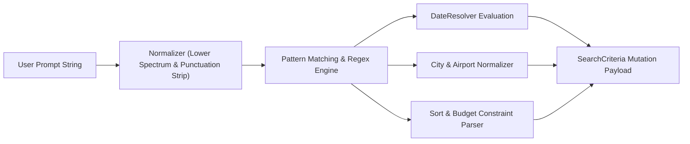
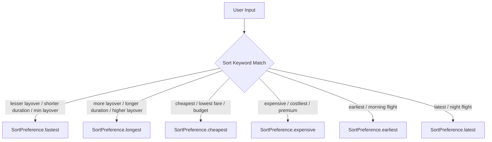

# 🧠 NLP Intent Engine & Date Resolver Deep-Dive

This document provides a line-by-line code walk-through and algorithmic breakdown of the deterministic **NLP Rule Engine** (`LocalRuleAiServiceImpl`) and temporal **Date Resolver** (`DateResolver`).

---

## 🎯 Architecture & Anchor Date Specification

The NLP engine operates deterministically relative to a static reference anchor date:

$$\text{Reference Date} = \mathbf{2026\text{-}09\text{-}07} \quad (\text{Monday, September 7, 2026})$$

All relative date calculations (*"tomorrow"*, *"next month 7"*, *"next weekend after the 12th"*) resolve deterministically against this anchor date.



---

## 📅 DateResolver Regex & Algorithmic Code Trace (`date_resolver.dart`)

### 1. Composite "Next Month [Day]" Pattern Trace

Expression: `"fly to dubai next month 7"` or `"7th of next month"`

```dart
// Regex Pattern:
final nextMonthDayMatch = RegExp(
  r'(?:next|nxt|following)\s+month\s+(?:on\s+)?(?:the\s+)?(?:date\s+)?(\d{1,2})(?:st|nd|rd|th)?|(\d{1,2})(?:st|nd|rd|th)?\s+(?:of\s+)?(?:next|nxt|following)\s+month',
  caseSensitive: false,
).firstMatch(cleanInput);

if (nextMonthDayMatch != null) {
  final dayStr = nextMonthDayMatch.group(1) ?? nextMonthDayMatch.group(2);
  final dayNum = int.tryParse(dayStr!);
  if (dayNum != null && dayNum >= 1 && dayNum <= 31) {
    final targetMonth = now.month + 1; // 9 + 1 = 10 (October)
    final targetYear = targetMonth > 12 ? now.year + 1 : now.year; // 2026
    final normMonth = targetMonth > 12 ? 1 : targetMonth; // 10
    return TravelDatePreference.exact(
      DateTime(targetYear, normMonth, dayNum), // DateTime(2026, 10, 7)
      originalExpression: input,
    );
  }
}
```

**Step-by-Step Code Execution for `"next month 7"`**:
1. `now` = `DateTime(2026, 9, 7)`
2. `nextMonthDayMatch` captures group `1` = `"7"`
3. `targetMonth` = `now.month + 1` = `10` (October)
4. `targetYear` = `2026`
5. Returns `TravelDatePreference.exact(DateTime(2026, 10, 7))` $\rightarrow$ **October 7, 2026**.

---

### 2. Offset Weekend Expression Trace

Expression: `"next weekend after the 12th"`

```dart
if (cleanInput.contains('after the 12th') || cleanInput.contains('after 12th')) {
  // Reference base date becomes Sep 12, 2026
  final baseDate = DateTime(now.year, now.month, 12);
  final sat = _getNextSaturday(baseDate);
  final sun = sat.add(const Duration(days: 1));
  return TravelDatePreference.range(sat, sun, originalExpression: input);
}
```

**Step-by-Step Execution**:
1. Base date set to `DateTime(2026, 9, 12)` (Saturday, Sep 12).
2. `_getNextSaturday(baseDate)` evaluates next Saturday after the 12th $\rightarrow$ **Sep 19, 2026**.
3. `sun` = `sat + 1 day` $\rightarrow$ **Sep 20, 2026**.
4. Output: Date range **Sep 19, 2026 – Sep 20, 2026**.

---

### 3. Comprehensive Date Parsing Matrix

| User Input Phrase | Calculation Method | Output `TravelDatePreference` |
|:---|:---|:---|
| `"today"` | `now` | `Exact(2026-09-07)` |
| `"tomorrow"`, `"tmw"` | `now + 1 day` | `Exact(2026-09-08)` |
| `"day after tomorrow"` | `now + 2 days` | `Exact(2026-09-09)` |
| `"this weekend"` | Next upcoming Saturday/Sunday | `Range(2026-09-12, 2026-09-13)` |
| `"next weekend"` | Following Saturday/Sunday | `Range(2026-09-12, 2026-09-13)` |
| `"next week"` | Next Monday to Sunday | `Range(2026-09-14, 2026-09-20)` |
| `"next month"` | Full calendar next month | `Range(2026-10-01, 2026-10-31)` |
| `"next month 7"` | 7th day of next month | `Exact(2026-10-07)` |
| `"date to 15"`, `"change date to 15"` | Target day in current/next month | `Exact(2026-09-15)` |

---

## 🏙️ City & Airport Code Normalization (`_resolveCity`)

`LocalRuleAiServiceImpl` maps informal city names, spelling variations, and 3-letter IATA airport codes to standardized canonical city names:

```dart
String? _resolveCity(String text) {
  final clean = text.toLowerCase().trim();
  if (clean.contains('mumbai') || clean.contains('bom') || clean.contains('bombay')) return 'Mumbai';
  if (clean.contains('delhi') || clean.contains('del') || clean.contains('new delhi')) return 'Delhi';
  if (clean.contains('dubai') || clean.contains('dxb')) return 'Dubai';
  if (clean.contains('singapore') || clean.contains('sin') || clean.contains('changi')) return 'Singapore';
  if (clean.contains('london') || clean.contains('lhr') || clean.contains('heathrow')) return 'London';
  if (clean.contains('new york') || clean.contains('jfk') || clean.contains('nyc')) return 'New York';
  return null;
}
```

---

## ↔️ Bidirectional Sort & Preference Resolution

The NLP engine supports bidirectional parsing of layover, duration, price, and departure time constraints:



### Exact Code Implementation:

```dart
// Bidirectional layover & duration sorting
if (clean.contains('lesser layover') || clean.contains('min layover') || 
    clean.contains('shorter duration') || clean.contains('minimum layover') ||
    clean.contains('fastest') || clean.contains('shortest')) {
  sortPref = SortPreference.fastest;
} else if (clean.contains('higher layover') || clean.contains('more layover') || 
           clean.contains('longer duration') || clean.contains('more duration') ||
           clean.contains('longest')) {
  sortPref = SortPreference.longest;
}

// Bidirectional price sorting
if (clean.contains('cheapest') || clean.contains('lowest fare') || clean.contains('inexpensive')) {
  sortPref = SortPreference.cheapest;
} else if (clean.contains('expensive') || clean.contains('costliest') || clean.contains('premium')) {
  sortPref = SortPreference.expensive;
}
```
