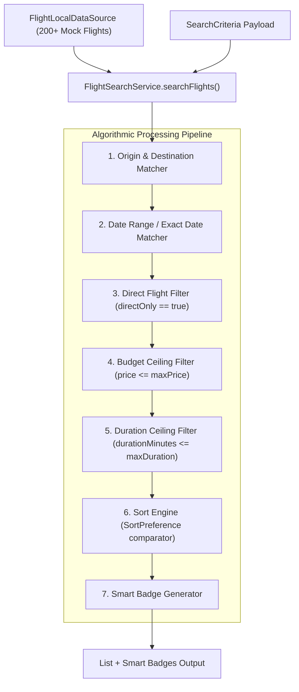

# ✈️ Smart Flight Search & Badging Engine Deep-Dive

This document details the internal architecture, algorithmic filtering pipeline, sorting algorithms, smart badge generation rules, and mock data distribution of `FlightSearchService` and `FlightLocalDataSource`.

---

## 🏗️ Architecture & Data Pipeline

`FlightSearchService` operates as a pure domain service that receives candidate flights from `FlightLocalDataSource` and applies deterministic constraint evaluation, sorting algorithms, and smart badging.



---

## 🔍 Multi-Criteria Filter Pipeline (`searchFlights()`)

```dart
List<Flight> searchFlights({
  required List<Flight> flights,
  required SearchCriteria criteria,
}) {
  return flights.where((flight) {
    // 1. Origin Filter
    if (criteria.origin != null && criteria.origin!.isNotEmpty) {
      if (flight.origin.toLowerCase() != criteria.origin!.toLowerCase()) {
        return false;
      }
    }

    // 2. Destination Filter
    if (criteria.destination != null && criteria.destination!.isNotEmpty) {
      if (flight.destination.toLowerCase() != criteria.destination!.toLowerCase()) {
        return false;
      }
    }

    // 3. Direct Only Filter
    if (criteria.directOnly == true && !flight.isDirect) {
      return false;
    }

    // 4. Maximum Price Ceiling
    if (criteria.maxPrice != null && flight.price > criteria.maxPrice!) {
      return false;
    }

    // 5. Maximum Travel Duration Ceiling (minutes)
    if (criteria.maxDuration != null && flight.durationMinutes > criteria.maxDuration!) {
      return false;
    }

    // 6. Date Preference Matching
    if (criteria.datePreference != null) {
      final pref = criteria.datePreference!;
      if (pref is ExactDatePreference) {
        final fDate = flight.departureTime;
        if (fDate.year != pref.date.year ||
            fDate.month != pref.date.month ||
            fDate.day != pref.date.day) {
          return false;
        }
      } else if (pref is DateRangePreference) {
        if (flight.departureTime.isBefore(pref.startDate) ||
            flight.departureTime.isAfter(pref.endDate.add(const Duration(days: 1)))) {
          return false;
        }
      }
    }

    return true;
  }).toList()
  ..sort((a, b) => _compareFlights(a, b, criteria.sortPreference));
}
```

---

## 📊 Bidirectional Sorting Comparator (`_compareFlights()`)

The sort comparator evaluates flights based on `SortPreference` enums:

```dart
int _compareFlights(Flight a, Flight b, SortPreference preference) {
  switch (preference) {
    case SortPreference.cheapest:
      return a.price.compareTo(b.price);

    case SortPreference.expensive:
      return b.price.compareTo(a.price);

    case SortPreference.fastest:
      // Sorts by total duration (minutes) ascending (shortest first)
      final durationCompare = a.durationMinutes.compareTo(b.durationMinutes);
      if (durationCompare != 0) return durationCompare;
      return a.layovers.length.compareTo(b.layovers.length);

    case SortPreference.longest:
      // Sorts by total duration (minutes) descending (longest journey first)
      final durationCompare = b.durationMinutes.compareTo(a.durationMinutes);
      if (durationCompare != 0) return durationCompare;
      return b.layovers.length.compareTo(a.layovers.length);

    case SortPreference.earliest:
      return a.departureTime.compareTo(b.departureTime);

    case SortPreference.latest:
      return b.departureTime.compareTo(a.departureTime);

    case SortPreference.none:
    default:
      return a.price.compareTo(b.price);
  }
}
```

---

## 🏷️ Smart Badge Generator (`generateSmartBadges()`)

The engine dynamically inspects search results and attaches smart highlight tags:

| Badge Tag | Highlight Trigger Condition | Render Styling |
|:---|:---|:---|
| `✓ Cheapest direct option` | Lowest fare among all direct flights in dataset. | Green Glassmorphism Pill |
| `✓ Shortest journey` | Minimum total `durationMinutes` in dataset. | Cyan Glassmorphism Pill |
| `✓ Premium option` | Highest price option with business class seats. | Amber Gold Glassmorphism Pill |
| `✓ Best Value` | Optimal price-to-duration ratio balance. | Indigo Purple Pill |

```dart
List<String> generateSmartBadges({
  required List<Flight> results,
  required SearchCriteria criteria,
}) {
  if (results.isEmpty) return [];
  final badges = <String>[];

  final cheapest = results.reduce((curr, next) => curr.price < next.price ? curr : next);
  final fastest = results.reduce((curr, next) => curr.durationMinutes < next.durationMinutes ? curr : next);

  if (criteria.directOnly == true || cheapest.isDirect) {
    badges.add("✓ Cheapest direct option (\$${cheapest.price.toInt()})");
  } else {
    badges.add("✓ Cheapest option (\$${cheapest.price.toInt()})");
  }

  badges.add("✓ Shortest journey (${fastest.durationMinutes ~/ 60}h ${fastest.durationMinutes % 60}m)");
  return badges;
}
```
