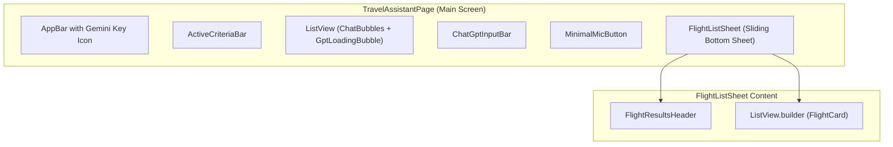

# 🎨 UI Component Catalog & Design System

This document provides a component guide and style system reference for the user interface, custom widgets, glassmorphism cards, and animations in the **AI Travel Booking Assistant**.

---

## 🎨 Theme & Glassmorphism System (`lib/core/theme/`)

The application implements a dark mode design system inspired by glassmorphism:

```dart
class AppColors {
  static const Color primary = Color(0xFF6366F1); // Indigo Primary
  static const Color secondary = Color(0xFF8B5CF6); // Deep Purple Secondary
  static const Color background = Color(0xFF0F172A); // Dark Slate Background
  static const Color surface = Color(0xFF1E293B); // Translucent Surface
  static const Color cardBackground = Color(0xCC1E293B); // Glass Card Background

  // Dynamic Badge Color Palette
  static const Color cheapestBadge = Color(0xFF22C55E); // Green
  static const Color shortestBadge = Color(0xFF06B6D4); // Cyan
  static const Color premiumBadge = Color(0xFFF59E0B); // Amber Gold
}
```

---

## 🧩 Component Catalog & Widget Architecture



---

## 📦 Key Widget Specifications

### 1. `GptLoadingBubble` (`gpt_loading_bubble.dart`)
- **Visual Appearance**: Dark indigo pill container with three animated pulsing dots and status text.
- **Role**: Renders in the chat stream whenever `VoiceChatState.isThinking == true`, giving ChatGPT-style feedback while AI evaluates constraints.

---

### 2. `FlightCard` (`flight_card.dart`)
- **Visual Appearance**: Translucent glassmorphic card with subtle border highlight, airline logo badge, departure/arrival timestamps, travel duration, layovers, price tag, and smart badges (*✓ Cheapest direct option*, *✓ Shortest journey*).
- **Interactions**: Tapping **"Book Now"** triggers `SelectFlightEvent(flight)`, launching `BookingDialog`.

---

### 3. `ActiveCriteriaBar` (`active_criteria_bar.dart`)
- **Visual Appearance**: Horizontal scrolling row of active filter chips (e.g. `Origin: Mumbai`, `Dest: Dubai`, `Date: Oct 7`, `Sort: Fastest`).
- **Interactions**: Individual chip close icons clear specific filter parameters; clicking **"Clear All"** resets criteria to defaults.

---

### 4. `TicketViewPage` (`ticket_view_page.dart`)
- **Visual Appearance**: Realistic boarding pass layout featuring QR code representation, PNR booking reference, flight details, departure gate, seat assignment, and passenger passport summary.
