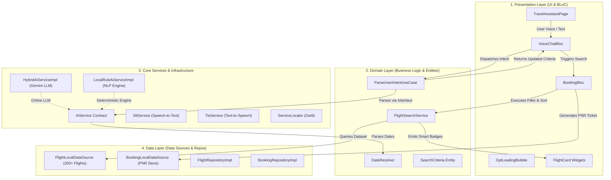

# AI Travel Booking Assistant

A production-grade voice & chat flight search and booking application built with Flutter, Clean Architecture, Google Gemini 1.5 Flash LLM, and a zero-config deterministic Local NLP Rule Engine fallback.

---

## 🚀 Key Features

> **Hybrid Intelligence Engine**: Works out-of-the-box with zero API key configuration via `LocalRuleAiServiceImpl` or online reasoning via `HybridAiServiceImpl` powered by Google Gemini 1.5 Flash.

- **🎙️ Conversational Voice & Text Interface**: Supports continuous Speech-to-Text (STT) and Text-to-Speech (TTS) audio output with ChatGPT-style thinking and search animation bubbles.
- **📅 Advanced Date & Layover Resolution**: Resolves complex temporal queries like *"next month 7"* (Oct 7, 2026 relative to reference date Sep 7, 2026), *"next weekend after the 12th"*, and bidirectional layover/duration preferences.
- **🏷️ Smart Badging & Filtering**: Automatically sorts and badges flights (*✓ Cheapest direct option*, *✓ Shortest journey*, *✓ Premium option*) based on explicit user constraints.
- **✈️ End-to-End Mock Booking**: Complete flight booking workflow generating digital tickets with unique PNR references.

---

## ⚙️ Project & Environment Configuration

The application and documentation site are configured with the following technical specifications:

### 🌐 Documentation Site Config (`_config.yml`)

| Property | Value / Setting | Description |
|:---|:---|:---|
| **Theme** | `ksauraj/stygian` | Pure Jekyll remote theme rendering standard Markdown |
| **Markdown Engine** | `kramdown` (GFM) | GitHub Flavored Markdown with auto ID generation |
| **Highlighter** | `rouge` | Code block syntax highlighting without extra JS overhead |
| **Base URL** | `/Ai-travel-booking-assistance` | Base path for GitHub Pages deployment |
| **Default Layout** | `layout: docs` | Applies doc navigation sidebar across all collection items |

### 🛠️ Runtime & Environment Variables

| Variable / Parameter | Setting | Description |
|:---|:---|:---|
| `GEMINI_API_KEY` | System Env or UI Dialog | Key for Google Gemini 1.5 Flash LLM (`AIzaSy...` or `AQ...`) |
| `reference_date` | `2026-09-07` | Base anchor date for relative NLP date resolution |
| `FLUTTER_WEB_USE_SKIA` | `true` | Enables high-performance canvas rendering on web target |

### 📦 Application Dependencies (`pubspec.yaml`)

| Package | Version | Purpose |
|:---|:---|:---|
| **Flutter SDK** | `^3.8.1` / Dart `^3.3.0` | Core SDK platform constraints |
| `flutter_bloc` | `^8.1.3` | Unidirectional state management (VoiceChat & Booking BLoCs) |
| `google_generative_ai` | `^0.4.6` | Google Gemini 1.5 Flash official Dart SDK integration |
| `speech_to_text` | `^7.0.0` | Device microphone capture & continuous STT transcription |
| `flutter_tts` | `^4.2.0` | Text-to-speech audio synthesis for voice responses |
| `get_it` | `^7.6.7` | Service Locator dependency injection container |
| `equatable` | `^2.0.5` | Value equality comparison for BLoC states and entities |
| `intl` | `^0.19.0` | Date formatting and temporal parsing utilities |

---

## 🏗️ Architecture At A Glance

The project follows **Feature-Driven Clean Architecture** with strict layer separation and unidirectional state flow:



### Layer Responsibilities & Contracts

| Layer | Directory Path | Core Responsibilities & Key Exports |
|:---|:---|:---|
| **Presentation** | `lib/features/flight_booking/presentation/` | UI Pages (`TravelAssistantPage`, `TicketViewPage`), Dialogs (`BookingDialog`), Widgets (`GptLoadingBubble`, `FlightCard`), BLoCs (`VoiceChatBloc`, `BookingBloc`). |
| **Domain** | `lib/features/flight_booking/domain/` | Pure Dart Entities (`SearchCriteria`, `Flight`, `Booking`), Use Cases (`ParseUserIntentUseCase`, `SearchFlightsUseCase`), Domain Services (`DateResolver`, `FlightSearchService`). |
| **Data** | `lib/features/flight_booking/data/` | Models (`FlightModel`, `BookingModel`), Data Sources (`FlightLocalDataSource` with 200+ flight mockups, `BookingLocalDataSource`), Repository Implementations. |
| **Core** | `lib/core/` | Global Service Locator (`GetIt`), AI Contracts (`AiService`, `HybridAiServiceImpl`, `LocalRuleAiServiceImpl`), Hardware Wrappers (`SttService`, `TtsService`), Utilities (`DateParser`, `ReferenceGenerator`). |

---

## ⚡ Quick Usage Example

```dart
// Parse natural prompt deterministically
final result = await parseUserIntentUseCase(
  userPrompt: 'Fly from Mumbai to Dubai next month 7 with lesser layover.',
  currentCriteria: const SearchCriteria(),
);

result.fold(
  (aiResult) {
    print('Action: ${aiResult.action}'); // SEARCH_FLIGHTS
    print('Departure Date: ${aiResult.updatedCriteria.dateText}'); // 2026-10-07
    print('Sort Preference: ${aiResult.updatedCriteria.sortPreference}'); // FASTEST
    print('Matching Flights: ${aiResult.matchingFlights.length}');
  },
  (failure) => print('Error: ${failure.message}'),
);
```

---

## 📚 Complete Documentation Set

Explore the full technical documentation suite:

1. [🏗️ Clean Architecture](Clean-Architecture) — Layer separation, dependency inversion, and BLoC state flow.
2. [📄 Codebase File Index](Codebase-File-Index) — Exhaustive file-by-file code guide explaining all 54 Dart files in the project.
3. [⚡ BLoC State Management & Audio Flow](BLoc-State-Management-Flow) — Deep-dive into `VoiceChatBloc`, `BookingBloc`, STT audio streams, thinking bubble, and PNR lifecycle.
4. [🧠 NLP Intent Engine & Date Resolver](NLP-and-Date-Resolver) — Line-by-line regex trace, anchor date math (*"next month 7"*), and city normalizers.
5. [✈️ Smart Flight Search Engine](Smart-Flight-Search-Engine) — Multi-criteria filter pipeline, sorting comparator, and smart badging rules.
6. [🧠 Hybrid Gemini LLM Integration](Hybrid-Gemini-LLM) — Online Google Gemini 1.5 Flash JSON schema enforcement and zero-config fallback.
7. [🎨 UI Component Catalog & Design System](UI-Widget-Catalog-and-Design) — Dark theme glassmorphism styling (`AppColors`, `AppTheme`) and widget catalog.
8. [📖 API Reference & System Contracts](API-Reference) — Entity contracts, sort enums, BLoC events, states, and failure definitions.
9. [🛠️ Installation & Setup Guide](Installation-Setup) — Workstation setup, API key options, and automated testing commands.
10. [❓ Troubleshooting & FAQ](Troubleshooting) — Diagnostic solutions for common questions, microphone permissions, and edge cases.

